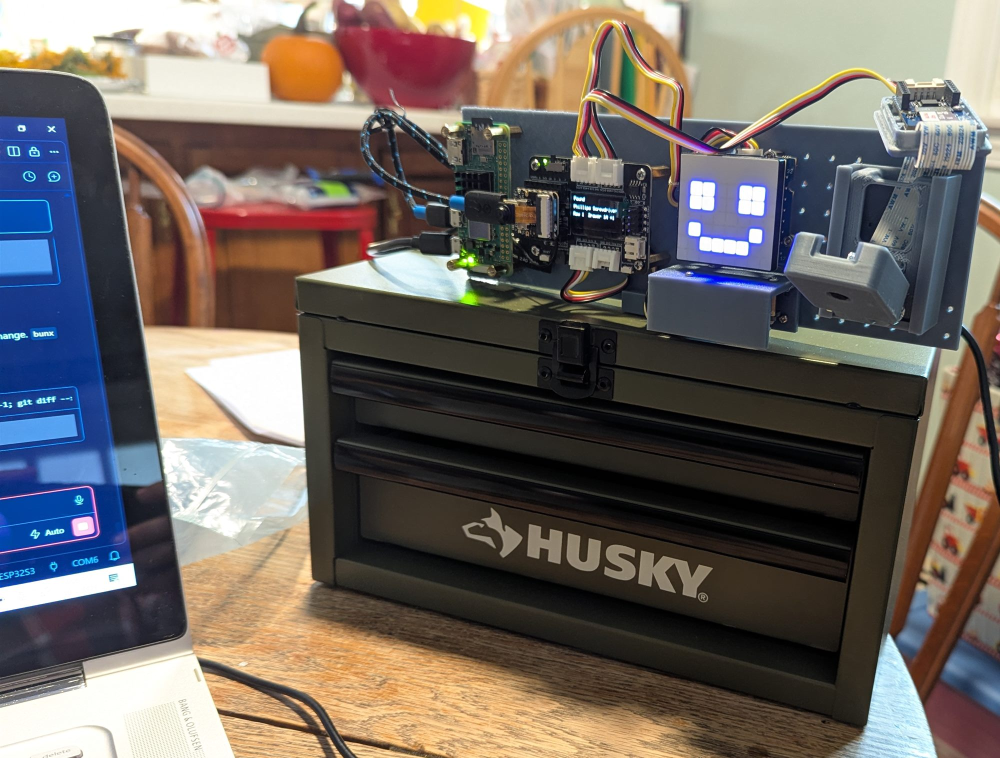

# SmartToolbox

A toolbox that tells you which drawer a tool is in. Say what you are looking for, and
the box answers on its screen and lights the row of drawers to open.



*The build as of October 2026. More photos in [docs/photos](docs/photos/).*

## How it works

1. **Ask.** Hold the button and speak, or say **"Hi ESP"** and then the tool's name.
2. **Listen.** A Seeed XIAO ESP32S3 records the audio and sends it over USB to a
   Raspberry Pi Zero 2.
3. **Transcribe.** The Pi has the audio transcribed by Whisper, running on a NAS or
   through OpenAI, and matches what was said against the tools it knows -
   "where are my needle nose pliers" finds *Needle-Nose Pliers*.
4. **Answer.** The box shows the drawer on its OLED (for example `Row 1, Drawer 1A`),
   lights that row on its 8x8 LED matrix and LED strip, and its face reacts while it
   listens, thinks, and answers.

## What works today

| Feature | State |
|---|---|
| Voice lookup - button, speech, drawer on screen and lit | Working |
| "Hi ESP" wake word | Working since firmware 0.28.0 |
| Several toolboxes, each with its own drawers and light rows | Working |
| Web dashboard for toolboxes, drawers, tools and settings | Working |
| Firmware updates over Wi-Fi (OTA) | Working |
| Recovery flashing over USB from the Pi | Working |
| Recognising common tool names on the box itself, skipping Whisper | Planned |
| Waking up when someone walks up (PIR sensor) | Planned - the sensor is wired, nothing reads it yet |
| Noticing which tools leave and return (camera) | Blocked - needs a trained vision model |

The spec keeps a status tag on every section, and
[docs/HARDWARE.md](docs/HARDWARE.md) records what each physical part is doing.

## The dashboard

The Pi serves a web dashboard on port 3000:

- **Dashboard** - the tools in each drawer of a toolbox, with request history.
- **Toolboxes** - add toolboxes and drawers, edit a drawer's name, label and light row,
  and choose which box the device is mounted on.
- **Devices** - the XIAO's firmware version, last contact and recent activity.
- **AI Settings** - where speech goes to be transcribed.

A copy of the dashboard running on a development machine has its own database, and
shows a **Local copy** badge so it is not mistaken for the real box.

## Hardware

- Seeed XIAO ESP32S3 Sense (on-board microphone) on the Expansion Board Base for XIAO,
  which carries the OLED and the push-to-talk button
- Raspberry Pi Zero 2, connected to the XIAO by USB
- Grove 8x8 RGB LED matrix and Grove WS2813 LED strip
- Grove PIR motion sensor and Grove Vision AI V2 (wired, not yet used)
- 3D-printed mounting plate and brackets, in [cad/](cad/)

Pins, wiring, and the state of every part are in [docs/HARDWARE.md](docs/HARDWARE.md).

## Repository layout

```
smarttoolbox/
├── api/                 # Bun + TypeScript server and dashboard (runs on the Pi)
│   ├── src/             # Server, SQLite database, serial link, transcription
│   ├── public/          # Dashboard pages - plain HTML, CSS and JS, no build step
│   ├── scripts/         # Firmware release, USB flashing, device commands
│   ├── deploy/          # systemd service for the Pi
│   └── sync.ps1         # Deploys the server to the Pi
├── firmware/            # Arduino sketch for the XIAO ESP32S3
├── cad/                 # Printed parts, with the source that generates them
└── docs/                # Hardware record, plans, sources and photos
```

## Getting started

### Run the server locally

```bash
cd api
bun install
bun run start    # http://localhost:3000
bun test
```

On Windows the serial link to the box does not start, so the server and dashboard run
fine with nothing attached - against their own local database.

### Deploy to the Pi

```powershell
cd api
.\sync.ps1           # copy the server to the Pi and restart it
.\sync.ps1 -Status   # service status and the end of its logs
```

### Firmware

The sketch builds with `arduino-cli` against the pinned versions in
`firmware/smarttoolbox/sketch.yaml`. Releases go out over Wi-Fi:

```powershell
cd api\scripts
.\release-firmware.ps1 -Version x.y.z -Push -Now   # the device fetches it within a minute
.\flash-device.ps1 -Version x.y.z                  # over USB, when OTA cannot help
```

A change to the flash partition table, such as the one that made room for the wake
word, can only be installed over USB.

## Documentation

- [.github/copilot-instructions.md](.github/copilot-instructions.md) - the project spec:
  architecture, database, every endpoint, the serial protocol, and debugging.
- [docs/HARDWARE.md](docs/HARDWARE.md) - every part, its pins, and whether it works.
- [docs/](docs/) - implementation plans (`PLAN-*.md`), each with its current status.
- [firmware/README.md](firmware/README.md) - firmware setup.

## License

[MIT](LICENSE). The vendored Grove matrix driver in `firmware/smarttoolbox/` keeps
Seeed's own MIT licence, alongside it.
